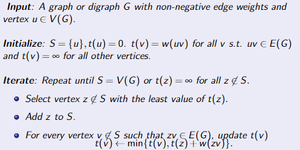
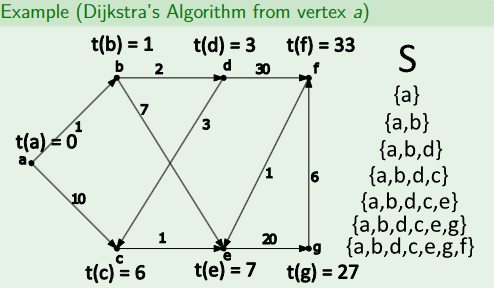
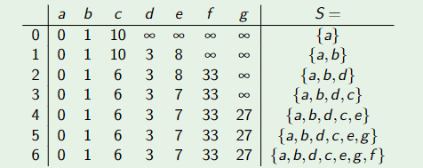

# Graph Theory MTH607
Implementing several concepts from Graph Theory into Code for fun!
## 1. Dijkstra's Algorithm
### 1.1. What is it?
Dijkstra's Algorithm is an algorithm used to find the shortest between two vertices (node) in a graph with non-negative edge weights.
### 1.2. Steps
- Find d(u,v) for all v ∈ V (G).
- Maintain a set S ⊆ V (G) and a *tentative weight* t(v) such that if v ∈ S, then t(v) = d(u,v) and if v ̸ ∈ S then t(v ) is the shortest u-v path
which only uses internal vertices from S.
### 1.3. How the algorithm works:

### 1.4. Example of implementating it by hand:
  fast-forward... =>  
### 1.5. Table Representation:

### 1.6. Attempting to implement it into code..